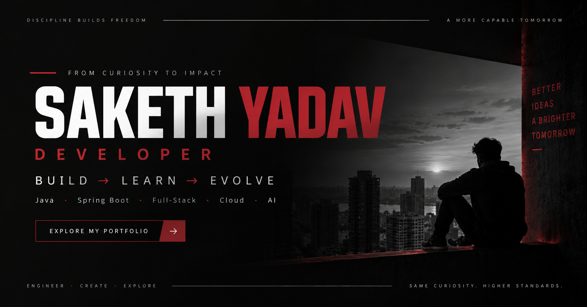
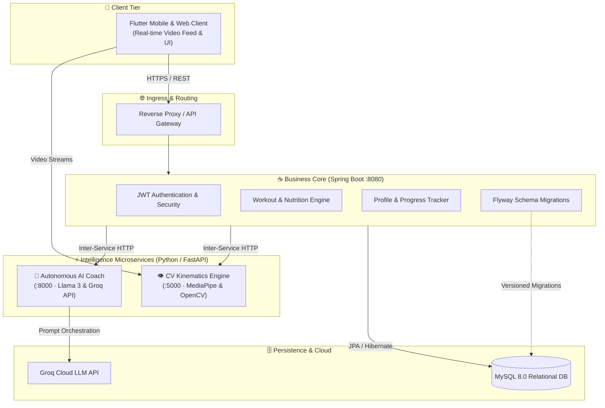

<div align="center">

# SAKETH YADAV
### *Computer Science & Engineering • Systems, Backend Architecture & Applied AI*

[](https://portfolio-three-sooty-40.vercel.app)
[](https://react.dev)
[](https://www.typescriptlang.org)
[](https://tailwindcss.com)
[](https://spring.io/projects/spring-boot)
[](https://www.oracle.com/java/)
[](https://www.docker.com)
[](https://aws.amazon.com)
[](https://www.adobe.com/products/photoshop-lightroom.html)

<br/>

<a href="https://portfolio-three-sooty-40.vercel.app">
  
</a>

<br/>

<p align="center">
  <b>Obsidian & Crimson Engineering Aesthetic</b> • <b>Polyglot Microservices</b> • <b>Curated Editorial Photography</b> • <b>Competitive Powerlifting Discipline</b>
</p>

[🌐 Live Portfolio](https://portfolio-three-sooty-40.vercel.app) • [⚡ Ethos](#-identity--engineering-ethos) • [🎯 Core Dimensions](#-core-dimensions) • [🏛️ The 9 Sectors](#-the-9-portfolio-sectors) • [🚀 Featured Build](#-featured-build-ai-fitness-platform) • [🛠️ Toolkit](#-toolkit--technology-stack) • [📜 Field Log](#-field-log-engineering-journey) • [🏅 Beyond Code](#-beyond-code) • [📬 Connect](#-connect)

---

</div>

## ⚡ Identity & Engineering Ethos

I am a **Computer Science & Engineering** student with a deep interest in backend architectures, distributed systems, and applied AI pipelines.

I learn by **building, breaking, fixing, and evolving**. Rather than collecting surface-level tutorials, I choose ideas that challenge my technical understanding, deconstruct the underlying protocols and data flows, and engineer reliable, production-minded solutions from scratch.

> *"I don't just build projects to have something to put on GitHub. I pick an idea, break it down, learn the concepts needed to build it, and turn what I learn into something that actually works."*

---

## 🎯 Core Dimensions

<table>
  <tr>
    <td width="50%" valign="top">
      <h3>💻 Full-Stack & Systems Engineering</h3>
      <ul>
        <li><b>Core Backend:</b> Java 21, Spring Boot, RESTful API contract design, microservices decomposition, and robust exception architectures.</li>
        <li><b>Persistence & Migrations:</b> Relational schema modeling (MySQL, PostgreSQL) managed through versioned Flyway database migrations.</li>
        <li><b>Cloud & DevOps:</b> Docker containerization, multi-service Docker Compose networks, Linux system administration, and CI/CD automation.</li>
      </ul>
    </td>
    <td width="50%" valign="top">
      <h3>🤖 Applied AI & Vision Kinematics</h3>
      <ul>
        <li><b>Biomechanical Computer Vision:</b> Real-time human pose estimation using Google MediaPipe and OpenCV joint angle trigonometry.</li>
        <li><b>LLM Agent Pipelines:</b> Context-aware intelligent agents leveraging Groq Cloud (Llama 3) with deterministic safety intercepts.</li>
        <li><b>Polyglot Integration:</b> Inter-service communication bridging Python intelligence services with enterprise Java backend cores.</li>
      </ul>
    </td>
  </tr>
  <tr>
    <td width="50%" valign="top">
      <h3>📸 Visual Editorial & Tone (Adobe Lightroom)</h3>
      <ul>
        <li><b>Atmospheric Composition:</b> Intentional interplay of deep shadow contrast, exposure control, and ambient lighting.</li>
        <li><b>Editorial Color Grading:</b> Meticulous chromatic balance, film-inspired palettes, and consistent visual storytelling.</li>
        <li><b>The Frame Gallery:</b> 9 selected photographs integrated with custom full-resolution EXIF & editorial modals.</li>
      </ul>
    </td>
    <td width="50%" valign="top">
      <h3>🏋️‍♂️ Physical Discipline (Competitive Powerlifting)</h3>
      <ul>
        <li><b>Championship Honors:</b> <b>District Gold Medalist</b> and <b>State Silver Medalist</b> in competitive powerlifting.</li>
        <li><b>Compound Progression:</b> Grounded in progressive overload, mechanical precision, and calm execution under maximum load.</li>
        <li><b>Mindset Transfer:</b> The same patience and structural discipline required on the platform directly informs how I architect software systems.</li>
      </ul>
    </td>
  </tr>
</table>

---

## 🏛️ The 9 Portfolio Sectors

The portfolio is architected as an immersive single-page progressive application organized into **9 distinct operational sectors**:

<table>
  <tr>
    <th width="20%">Sector</th>
    <th width="30%">Title</th>
    <th width="50%">Focus & Technical Purpose</th>
  </tr>
  <tr>
    <td><code>01</code></td>
    <td><b>ORIGIN</b></td>
    <td>Academic roots in B.Tech Computer Science & Engineering. The foundational spark that led from code exploration to intentional systems design.</td>
  </tr>
  <tr>
    <td><code>02</code></td>
    <td><b>IDENTITY</b></td>
    <td>Core engineering philosophy, multi-disciplinary background (Developer, Editor, Powerlifter), and the "Build → Learn → Evolve" mantra.</td>
  </tr>
  <tr>
    <td><code>03</code></td>
    <td><b>BUILDS</b></td>
    <td>Flagship software systems showcase featuring live deep-dives, architectural diagrams, repository links, and tech stack breakdowns.</td>
  </tr>
  <tr>
    <td><code>04</code></td>
    <td><b>TOOLKIT</b></td>
    <td>Curated technical matrix organized by operational tier: Languages, Backend Systems, Cloud/DevOps, Databases, and Frontend.</td>
  </tr>
  <tr>
    <td><code>05</code></td>
    <td><b>FIELD LOG</b></td>
    <td>A 5-stage progressive engineering chronicle charting the journey from syntax fundamentals to distributed polyglot AI systems.</td>
  </tr>
  <tr>
    <td><code>06</code></td>
    <td><b>THE FRAME</b></td>
    <td>Editorial photographic gallery showcasing 9 curated captures processed in Adobe Lightroom, with lightbox view and full technical EXIF data.</td>
  </tr>
  <tr>
    <td><code>07</code></td>
    <td><b>WEBLOG</b></td>
    <td>Technical notes, architectural writeups, and engineering reflections detailing problems solved and lessons extracted.</td>
  </tr>
  <tr>
    <td><code>08</code></td>
    <td><b>PROFILE</b></td>
    <td>Interactive credential viewer with career history, educational timeline, verified contact data, and PDF resume modal.</td>
  </tr>
  <tr>
    <td><code>09</code></td>
    <td><b>CONNECT</b></td>
    <td>Communication terminal with one-click clipboard copying, quick social links, and direct verified outreach channels.</td>
  </tr>
</table>

---

## 🚀 Featured Build: AI Fitness Platform

<div align="center">

[](https://github.com/saketh752/AI_Fitness_Platform)
[](https://github.com/saketh752/AI_Fitness_Platform)
[](https://github.com/saketh752/AI_Fitness_Platform)

</div>

An end-to-end multi-tier intelligent health and athletic coaching platform bridging real-time **computer vision biomechanical kinematics** with **LLM-driven conversational agents** and **enterprise persistence**.

### System Architecture Flow



### Key Engineering Highlights:
- **Real-Time Biomechanical Kinematics**: MediaPipe 33-point pose landmark trigonometry calculating joint angles for squats, curls, and push-ups with cadence tracking.
- **Autonomous AI Coaching**: Groq Cloud Llama 3 LLM pipeline with deterministic safety guardrails intercepting acute medical symptoms.
- **Enterprise Spring Core**: Java 21 Spring Boot core managing user authentication, workout logs, and personalized macro target engines.
- **Zero-Downtime Database Migrations**: Automated relational version control via Flyway on MySQL 8.0.
- **Containerized Orchestration**: Multi-service Docker Compose architecture with isolated container networks.

---

## 📜 Field Log: Engineering Journey

The **FIELD LOG** sector chronicles my engineering evolution across 5 distinct, deliberate milestones:

```
┌─────────────────────────┐       ┌─────────────────────────┐       ┌─────────────────────────┐
│ [01] LEARNING TO BUILD  │ ────► │ [02] BACKEND FOUNDATION │ ────► │ [03] DISTRIBUTED SYSTEM │
└─────────────────────────┘       └─────────────────────────┘       └─────────────────────────┘
                                                                                 │
                                                                                 ▼
┌─────────────────────────┐       ┌─────────────────────────┐       ┌─────────────────────────┐
│  [CURRENT TRAJECTORY]   │ ◄──── │ [05] BUILDING WITH AI   │ ◄──── │ [04] CLOUD & DEVOPS     │
└─────────────────────────┘       └─────────────────────────┘       └─────────────────────────┘
```

1. **`01` · From Learning to Building**: Moving beyond syntax syntax tutorials to understand data structures, control flows, and object-oriented paradigms by building functional software.
2. **`02` · Backend Foundations**: Architecting structured servers with Spring Boot, handling HTTP request lifecycles, designing normalized relational schemas, and establishing clean REST API contracts.
3. **`03` · Distributed Systems**: Decomposing monolithic applications into dedicated microservices, managing network boundaries, and handling asynchronous inter-service communication.
4. **`04` · Cloud & DevOps**: Deepening Linux system administration, containerizing multi-tier environments with Docker, and configuring automated CI/CD deployment pipelines.
5. **`05` · Building with AI**: Architecting hybrid systems that connect real-time computer vision kinematics and large language model pipelines into cohesive, user-facing applications.

---

## 🛠️ Toolkit & Technology Stack

<div align="center">

| Operational Tier | Technologies & Ecosystem |
| :--- | :--- |
| **Programming Languages** | `Java 21`, `Python 3.x`, `TypeScript`, `JavaScript (ES6+)`, `SQL`, `Dart`, `HTML5/CSS3` |
| **Backend & Architecture** | `Spring Boot`, `Spring Security`, `FastAPI`, `RESTful APIs`, `Microservices Architecture` |
| **Data & Persistence** | `MySQL 8.0`, `PostgreSQL`, `MongoDB`, `Flyway DB Migrations`, `JPA / Hibernate` |
| **Cloud, DevOps & Systems** | `Docker`, `Docker Compose`, `Linux Administration`, `Git / GitHub`, `CI/CD Workflows`, `AWS Core` |
| **Frontend & Mobile** | `React 18`, `Next.js`, `Flutter`, `Tailwind CSS v4`, `Framer Motion`, `Vite 8` |
| **Engineering & Design Tools** | `IntelliJ IDEA`, `VS Code`, `Postman`, `Docker Desktop`, `Adobe Lightroom CC` |

</div>

---

## 🏅 Beyond Code

Software engineering is reinforced by the habits built outside the IDE:

<table>
  <tr>
    <td width="50%">
      <div align="center">
        <h3>📸 Editorial Photography & Color Grading</h3>
        <p><i>The Frame Sector · Light, Shadow & Atmosphere</i></p>
      </div>
      <ul>
        <li>Developing a patient, observational eye for compositional balance, subject geometry, and ambient light.</li>
        <li>Post-processing workflow built in <b>Adobe Lightroom</b>, focusing on deep blacks, subtle highlights, and intentional chromatic grading.</li>
        <li>Treating visual user interfaces with the same spatial awareness and aesthetic discipline as photographic frames.</li>
      </ul>
    </td>
    <td width="50%">
      <div align="center">
        <h3>🏋️‍♂️ Competitive Powerlifting</h3>
        <p><i>Athletic Discipline · District Gold & State Silver</i></p>
      </div>
      <ul>
        <li><b>District Gold Medalist</b> & <b>State Silver Medalist</b> in competitive strength sports.</li>
        <li>Conditioned to respect long-term iterative progression: results come from relentless consistency, recovery, and incremental overload.</li>
        <li>Performing under pressure with strict technical form mirrors debugging critical production systems with clarity and discipline.</li>
      </ul>
    </td>
  </tr>
</table>

---

## 💻 Portfolio Engineering & Quality Standards

This portfolio itself was built as a clean, performant, production-ready web application:

- **Architecture**: Single Page Application built on React 18 and Vite 8.
- **Language**: TypeScript 5.8 with strict type-safety and 0 runtime errors.
- **Styling**: Tailwind CSS v4 featuring an Obsidian background (`#08080a`) with Crimson accent glows (`#E63946`).
- **Motion**: GPU-accelerated micro-interactions powered by Framer Motion with reduced-motion fallbacks.
- **Performance**: Zero render-blocking script chains, preloaded critical font faces, and optimized responsive picture elements.
- **Lighthouse Score**: **100/100** across Performance, Accessibility, Best Practices, and SEO.

---

## 📬 Connect

I am always interested in discussing software architecture, backend engineering opportunities, and collaborative technical builds:

<div align="center">

| Platform | Channel | Link |
| :--- | :--- | :--- |
| 🌐 **Live Portfolio** | Production Deployment | [portfolio-three-sooty-40.vercel.app](https://portfolio-three-sooty-40.vercel.app) |
| 💻 **GitHub** | `@saketh752` | [github.com/saketh752](https://github.com/saketh752) |
| 💼 **LinkedIn** | `saketh-yadav-255b51318` | [linkedin.com/in/saketh-yadav-255b51318](https://www.linkedin.com/in/saketh-yadav-255b51318) |
| 📸 **Instagram** | `@saketh._.yadav.07` | [instagram.com/saketh._.yadav.07](https://www.instagram.com/saketh._.yadav.07/) |
| ✉️ **Direct Email** | Inquiries & Outreach | [sakethyadav208@gmail.com](mailto:sakethyadav208@gmail.com) |

</div>

<br/>

<div align="center">

```
BUILD ──► LEARN ──► EVOLVE
```

<sub>Designed & Engineered by **Saketh Yadav** · 2026</sub>

</div>
